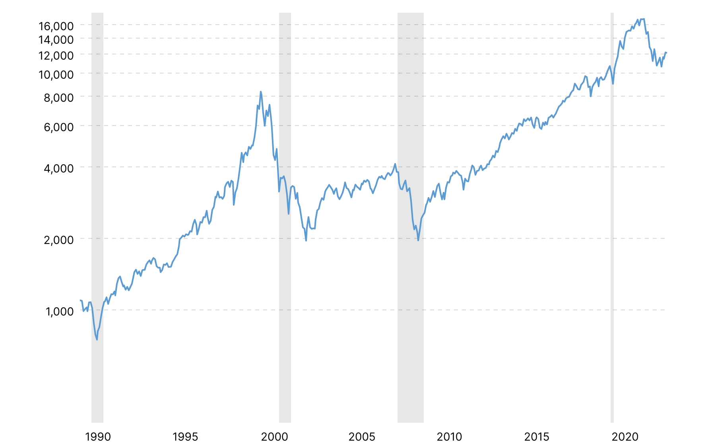

## Introduction

We all have grown used to an ubiquitous and apparently relentlessly evolving digital domain. Far from intending to judge, and for sure not to evaluate the positiveness and the drawbacks of digital technology in general, this thesis intends to question the deeper historical, philosophical and sociological framework at the core of Computer Sciences, with a special focus on the Internet.

The majority of humanist endeavors to analyze Information Technology—be them journalistic or academic—too easily stumble upon a dogmatic vision of the status quo, conducting research on superficial phenomena, seldom proposing arguments outside the current paradigm. Anything that involves tinkering with code or with computers is believed to be a <q>nerds</q> matter.

With this thesis, I advocate for a paradigm subversion, a novel interpretation of computer sciences as social, human, sciences. The following pages are meant to bring to light how socio-philosophical—but also political—approaches to the virtual domain too often just scratch the surface of a science that has unprecedentedly shaped humanity. Making truly better technology should mean putting thought, not money, first.

This dissertation follows a chronological order. It starts from a selection of relevant facts of the story of the Internet, then it goes on addressing how it arguably degenerated to what it is now, and why current digital technology should be labeled as <q>surveillance capitalism</q>. By shifting our attention to the future of the Internet, the approach too is going to be shifting from a phenomenological and ontological one to a normative one.

## An Historical Account

The Internet we supposedly know nowadays is so vast, ubiquitous, and complex that it is virtually impossible to frame it within a clear and unique meaning. Nevertheless, no matter how confusing the digital world has grown to be, the Internet’s most technical and fundamental structure is the one from which any other significant aspect stems. Therefore, the unavoidable starting point for any comprehensive argumentation concerning the Internet must be a critical general analysis of its relatively brief but extremely dense and eventful history. Since this dissertation is not chiefly concerned with the past, but rather it focuses on the present and on the future of the Internet, my historical assessment will be fairly superficial, and limited to the aspects that I pinpoint as crucial to understand the current dynamics governing the Web of today, be them positive or negative.

### Paul Baran’s <q>centrifugal</q> network

The Internet was born out of the strategic military endeavors of the US, stimulated by the Cold War. The security of the national communication infrastructure was among the country’s most pressing concerns. In particular, the primary worry was the lack of coordination capabilities to launch a counterattack after a potential first strike by the USSR [@ReportNETEvaluation1963]. This problem brought the engineer Paul Baran to conceive a game-changing communication system based on the fragmentation and decentralization of packages of information, to prevent having a single point of failure. In his <cite>A History of the Internet and the Digital Future</cite>, Johnny Ryan highlights the essential principles of Baran’s idea [@ryanHistoryInternetDigital2010]:

> Baran’s concept had the same **centrifugal** character that defines the Internet today. At its most basic, … the “centrifugal” approach is <u>to flatten established hierarchies and put power and responsibility at the nodal level</u> so that each node is equal. Baran’s network focused on what he called <q><u>user to user rather than … centre-to-centre operation</u></q>.

What was revolutionary was indeed the counter-intuitive effort to disperse and split up information rather than consolidating and securing it within one single communication channel. Therefore, instead of focusing on making the existing system as fail-proof as possible by attempting to physically and theoretically secure a few core and indispensable communication centers, Baran put in question that very structure, and turned it upside down [@baranDistributedCommandControl1960]. It does not come as a surprise to know that his idea was so brilliant and courageous to be considered too risky. Baran’s invention was projected to cost 60 millions dollars in order to be implemented in 1964, on the opposite, the existing centralized and radio-based communication system was costing 2 billions per year. Despite the blatant economical advantages and the immense technological potential of this system, AT&T, the major US communication company in the US at the time, refused to invest in the project [@barnPaulBaranInterview1999]. Such reluctance is not limited to the embryonic internet of the early 70s, but it is rather a common trait of the initial history of the Internet, up until the early 90s.

### Licklider and ARPA

The main reason of such diffused skepticism could be easily traced back to the subversive and literally revolutionary vision the early internet brought forward. In a century thorn by global wars, astonishing and unsettling discoveries, the last thing politics and the market wanted was to start questioning one of the most essential and reliable tools people could count on: the communication system. Still, once it entered the play field of technological advancement, the Internet showed a potential too great to be dismissed for good. Even before Baran’s theory, already in February 1958 the <abbr title='Advanced Research Projects Agency'>ARPA</abbr> (predecessor of the current widely known <abbr title='Defense Advanced Research Projects Agency'>DARPA</abbr>) was born [@schaferBackRootsARPANET2019]. One of its most prominent figures was the psychologist and computer scientist Joseph Carl Robnett Licklider, who soon became one of the protagonists of the history of the Internet. For him too, Ryan frames perfectly his visionary and ambitious plan:

> At the core of Licklider’s thinking was <u>an emphasis on collaboration</u>. Licklider posited a future scenario in which a researcher at one research centre could find a useful computer resource over the network from a research centre elsewhere. This, in a world of incompatible machines and jealously guarded computing resources, was far-sighted talk indeed.

As the Internet was kicking off, breeding Licklider’s ambition was not an elitist ensemble of highly trained engineers or capable government contractors, but rather a quite rambling and undefined bunch of Computer Sciences undergraduates from several US universities. Funded by ARPA, they created an informal <q>network working group</q>.

> Finding themselves working in a vacuum, the students connected to ARPANET, who had been given the task in 1969 of developing the technical protocols, also began <u>to establish the informal protocols that would influence interpersonal communications on the Internet in general</u>.  
> Uncertain of their positions within the hierarchy of the ARPANET project, the students issued notes of their protocols under the title <q>Request for Comments</q> (RFC). Steve Croker, a graduate student who received his bachelor’s degree at UCLA only a year before, used the title Request For Comments to <u>make the invitation to participate as open as possible</u>, and <u>to minimize any claim to authority</u> that working on so crucial an aspect of the network as its protocols might imply.

As further evidence of the deeply informal and casual setting within which the internet was conceived, Croker recalls: <q>I had to work in a bathroom, so as not to disturb the friends I was staying with, who were all asleep</q> [@crockerHowInternetGot2009].  
From that very bathroom was drafted the first request for comments of many to come, as they still form the core of the Internet we use today. Darius Kazemi, a scholar and Internet activist, in 2019 published [a series of blog posts](https://write.as/365-rfcs/365-ietf-rfcs-a-50th-anniversary-dive) explaining, analyzing, and commenting all the RFCs published until that year, highlighting their major role in defining the Internet [@kazemiRFCs]. It is worth noting how curious it is that Computer Science is arguably the only science where protocols, standards, and laws formalized at the earliest stage of technological development are still at the core of present cutting-edge tools and products.

### The Web

Profiting of what had grown to be an actual “Internet”, in 1990 CERN researcher Tim Berners-Lee created the Web. His work started from defining HTML, literally the <q>HyperText Markup Language</q>, meaning a formal language that allowed to insert hyperlinks inside any text. In this case too, the fundamental purpose of the digital pioneer was to create connections outside the mere content of a writing, but linking keywords to other sources, creating a potentially infinite network of resources connected to each other. Today the concept of a “link” is so diffused it is taken from granted, but during the last decade of the XIX century it was a curious novelty casting a completely new perspective, and arguably even a new mentality paradigma. Hence, during its first few years, HTML adoption was so deluding that for a long time the only document written in HTML was CERN’s telephone directory [@berners-leeWorldWideWeb1998]. Slowly but steadily, thanks to great commitment and sacrifices by Berners-Lee, the Web community grew to be world wide: in 1994 the early developers of the World Wide Web met for a <q>www wizards’ workshop</q>. Berners-Lee proposed the idea of a consortium to oversee the future direction of the Web. The www Consortium, known as “W3C”, was formed to promote interoperability and standardization of web technologies [@FactsW3C].

Summarizing, we could pinpoint a few chief traits encompassing roughly the first 30 years of the history of the Internet:

- a widespread *diffidence* by non-experts towards digital telecommunications, because of its subversive *complexity*, but also because of…
- …a fundamental *counter-intuitiveness* of the infrastructure, based on…
- …a heavily *decentralized* system, where no main node exists, and whose effectiveness is based on the *distribution* and *redundancy* of information and computing resources;
- a focus on *collaboration*, on *sharing ideas* and resources, on commonly defined standards allowing *interoperability*;
- both a strive and a drive for *interconnecting* concepts, users, and devices;
- a diffused feeling of liberty and *curiosity*, fostered by a great *informality* coupled with a cozy and friendly community;
- lack of interest from the financial world.

These considerations are of critical significance as they offer an invaluable point of view to analyze the Internet of today by first recognizing the long-gone environment it was conceived in. This atmosphere might even appear as whimsical and idealistic, yet this was the panorama before the watershed events that turned the wonderful Web 1, the one described up to now, into the monstrous gigantic monolith of Web 2. I argue that, as far and as deep as my research could go, 1994 was the last year during which the development of Web technologies and of the Internet as a whole was carried out as disentangled from any economical speculative purpose [@kahinCommercializationInternetSummary1990].

### The Internet’s original sin

I identify April 30th 1995 as the date of what I believe to be the “original sin” of the Internet: unhindered by any kind of regulation, the property of the Internet was passed by the US’ National Science Foundation (NSF) to private contractors exclusively.

It is greatly beyond the scope of this writing to bring forward the public vs. private debate, nor it is to inquire whether financial drives are positive or negative, but it is blatant that the “free space” left by the public organizations taking gradual steps back in their involvement with the Internet was rapidly filled by private entities oriented towards profit and driven by it. The first <q>dot com</q> boom of the 1990s was measured by and within the market, using an economical-first approach. Such way of thinking irreversibly influenced, possibly even biased, the framework of evaluation and conception of the Internet and, more specifically, of the Web. Not only this perspective changed the Internet (and Computer Sciences) for good, but it warped the global financial market, too: whereas in the pre-dot-com era a company required a minimum of four quarters of profitability to attract funding, these rules were forgotten in the dot-com frenzy.

Indeed, in 1995, one year later the first www conference, Netscape, developing <cite>Mosaic Netscape</cite> browser, advanced its Initial Public Offering for US$28 per share: it was the highest <abbr title='Initial Public Offering'>IPO</abbr> to date [@NetscapeCommunicationsCorporation1995]. This event is the first key milestone to interpret what I argue to be a common thread and threat of all of the evolution of technologies related to the Internet: some innovation remains niche and complex until some corporation sees a profitability potential in it, thus it invests to start “commodifying” it. Albeit commodification has a positive value, since it increases the diffusion of a technology, it comes with significant trade-offs in terms of freedom for its users, who remain trapped by getting used to use a tool they do not understand, hence they can be easily manipulated to achieve market purposes. This idea is at the core of consumerism and capitalism, and there is nothing new about this. The point I would like to raise in this dissertation is that hidden behind a thick cover of code and sophisticated technical devices lies a truly social matter which has never considered: in the domain of Computer Sciences, be it because of its extreme complexity caused by multiple layers of protocols, standards and code, the strictly social aspect has been investigated very little.

## The spread of Surveillance Capitalism

At the dawn of the second millennium, the World was experiencing an almost unprecedented technological revolution. Guiding this crusade aimed at claiming control over the future of humanity—thanks to the wonders of the Internet—were a sweeping amount of newborn companies, mainly US-based. The thrill born out of an astounding and appealing opportunity of profit drove virtually anyone to bet on this game-changing technology, which was turning out to be <q>the big next thing</q>. Nevertheless, the end of previous chapter narrates a different story. Fouled by the incredible innovations technological research gave birth to, investors went all-in to support this trend, which exploded in what has been labeled as <q>the dot-com bubble</q> [@chenSavingRainyDay2018].

As history repeats itself, the run for investments at the beginning of the Internet essentially has no difference with the run for gold of the Wild West, the early speculation on oil extraction between the XIX and the XX century, or the cryptocurrencies and <q>Web3</q> mania: intercepting the faintest opportunity for profit, an economically-driven society such as the current global one makes its best effort to explore and exploit it. I believe that, since its original sin, the Internet showed to be one of such opportunities and, possibly, the greatest.

A few examples to notice the trend. Particularly since the explosion of Facebook in 2004, centralized for-profit social networks started harvesting users’ data as their business model [@liaoMiningUserKnowledge2014], but only after more than a dozen years later, in 2018, the European Union was able to publish its General Data Protection Regulation (GDPR) to hinder privacy violations and enforce fundamental digital privacy rights [@laybatsGDPRImplementingRegulations2018], [@fuchsPoliticalEconomyCapitalist2015]. Centralized and closed messaging software such as WhatsApp quickly monopolized the way people communicated since the early 2010s [@fernandezrobinWhatsApp2017], and only in 2022 the European Parliament approved the Digital Markets Act (DMA) [@DigitalMarketsAct2022], forcing the biggest messaging platforms to open their protocols and concede Adversarial Interoperability, one of the key solutions I will extensively investigate by drawing the conclusions of this Thesis. As a last example, since the last months of 2022 the public debate has been inflamed by the sudden rise of “Artificial Intelligence” (AI), but EU’s <cite>AI Act</cite> [@ProposalREGULATIONEUROPEAN2021] is still in the works.

Regardless of the relentless lobbying efforts or of any more or less relevant external factor, the pattern is clear: when technological advancement is driven by economic interest, the sole rule that matters at the beginning is to make profit, and any ethical concern for socio-political repercussions is ignored or even discarded, until public institutions come into play. Humanist, political, or social analyses are carried out *a posteriori*, therefore with a limited possibility of actually limiting the damage, since the innovation under scrutiny has already become widespread.

How is that so, and, most importantly, why?

Studying the phenomenon of the degeneration of the Internet because of its fagocitation by Capitalism is Shoshana Zuboff, Stanford emeritus professor of Sociology who has been dedicating the last fifteen years completely on unmasking what she named <q>Surveillance Capitalism</q>. Her work <cite>The Age of Surveillance Capitalism</cite>, published in 2018, constitutes a milestone which is the basis of any analysis of the Web of today, proving that it cannot be investigated if not through the lens of Capitalism [@zuboffAgeSurveillanceCapitalism2019].

As the present chapter is going to show, the definition and the very nature of the contemporary digital world cannot be separated from the social, political and economical environment of today. It is because of this reason that diving deeper in understanding surveillance capitalism corresponds to investigating the present issues in global technology.

> Surveillance capitalism unilaterally claims <u>human experience as free raw material</u> for translation into behavioral data.

Usually, behavioral data is disguised as useful or even necessary to improve products, but Zuboff recognizes that gathered data are far more than the ones which are actually used. As a consequence, companies collect *behavioral surplus*, traded within *behavioral futures markets*. As traditional capitalism is based on the practice of evaluating business in function of the estimated future profit, surveillance capitalism is built upon the eagerness <q>to lay bets on our future behavior</q>. Still, surveillance capitalism is not to be read as “yet another representation of capitalism”, but it radically redefines how the market, geopolitics (as the case study in the next chapter is going to prove), and even psychology [@verduynSocialNetworkSites2017] work in the contemporary world.

### <q>The Unprecedented</q>

Zuboff recognizes that <q>one explanation for surveillance capitalism’s many triumphs floats above them all: it is *unprecedented*</q>. She compares the phenomenon which concerned the Internet in the early 2000s to a fire that burnt her house to the ground after it got struck by a lightning. When it happened, professor Zuboff believed she had the time to gather the most important things in the house before evacuating, because she observed that the smoke coming out of the striking point was feeble and localized. Nevertheless, the fire marshal got to the house just in time to throw professor Zuboff out of the house, before it suddenly exploded.

Zuboff uses this real life example to prove that the true danger lies in the unprecedented: just as she could have never known that, regardless of the thickness of the smoke she was seeing, her house could explode, the author argues the world is not able to tackle the nature of surveillance capitalism without shifting or even wholly reversing the paradigma with respect to any conventional socio-economical analysis.

> The unprecedented nature of surveillance capitalism has enabled it to elude systematic context because it cannot be adequately grasped with our existing concepts. \[…\] <u>the existing categories fall short in in identifying and contesting the most crucial and unprecedented facts of this new regime</u>.

Thus, the first step we are required to entertain is to deconstruct and demystify the castle of sand built by surveillance capitalism. In order to do so, it must be acknowledged how such endeavor cannot be carried out using solely computer engineering instruments, but considering the deep interrelation between any technical infrastructure and the socio-economical purposes that shape it. Even though the strictly technical tools are assumed as unquestioned axioms by social scientists, reality proves the opposite: it is exactly the socio-economical environment that determines the imperatives technological development should follow. The lack of a deeper understanding of code and information technology from a humanistic perspective attributes a dogmatic approach to any study concerning Computer Science.

> <u>Surveillance capitalism is not technology</u>; it is a logic that imbues technology and commands it into action. Surveillance capitalism is a market form that is unimaginable outside the digital milieu, but it is not the same as the “digital”. \[…\] surveillance capitalists want us to think that their practices are inevitable expressions of the technologies they employ.

Zuboff highlights the unquestioned “inevitability” attributed to the current way technological devices work. The excuse of addressing technical complexity brought digital companies to build their products with parts conceived to make the same products—be them hardware or software—more profitable or more functional to the producer’s, and not the user’s, interests. Among the firsts to notice this malicious practice was Richard Stallman, one of the last hackers remaining at MIT in the 1980s. His main concern was the depiction as illicit of any product tampering—especially if made collaboratively—that bypassed the control of the company. In Stallman’s words [@stallmanFreeSoftwareFree2002]:

> This meant that the first step in using a computer was to promise not to help your neighbor. <u>A cooperating community was forbidden</u>. The rule made by the owners of proprietary software was, <q>if you share with your neighbor, you are a pirate. If you want any changes, beg us to make them</q>

The proprietary control exercised by the manufactures was a return to the centripetal approach of the old mainframe companies. To fight this worrisome and little understood matter, Stallman founded the free software movement in 1983, now the Free Software Foundation (FSF), as <q>a movement for computer users’ freedom</q>. The battle for <q>free software</q> (often followed by the specification <q>free as in freedom, not free beer</q>, in order to clarify that software freedom went beyond the economical aspect), as fierce as it was, was and it still remains a very niche world of which there is very limited knowledge.

Nevertheless, from the hacker revolution in August 1991 Linux was born. Initially a hobby project by Linus Torvalds, at the time an undergraduate Computer Sciences student from the University of Helsinki, Linux now is the most used Operating System (OS) in the world [@moodyGreatestOSThat]. Albeit it is common knowledge that the vast majority of people use computers running Microsoft’s Windows or Apple’s MacOS, Linux actually powers most of the world servers, hence it composes the bedrock of the whole Internet. Furthermore, Android, Google’s OS for mobile devices, is a modified version of the Linux kernel (the kernel is the heart of an OS) [@LinuxStatistics2023].

The story of Linux is astonishing as much as it is exemplary of the pattern being followed by the technology industry. Its development was and still is carried out by a community of hundreds of thousands of volunteer developers in any corner of the world, with Torvalds as its <q>benevolent dictator</q> [@rivlinLeaderFreeWorld]. The organizational framework recalls the one envisioned by Licklider: researchers and students chorally pushing forward technological development in an horizontal environment within which the main purpose is to genuinely enhance a product rather than trying to squeeze as much profit as possible out of it.

### Economy and technology: an inseparable duo

The Linux phenomenon and the events of the early 2000s make it easy to recognize the pattern that composes the anthem of digital capitalism: whenever a situation emerges, showing the same characteristics listed in the bullet points of the previous chapter, capitalism comes into play and subverts the framework, losing any horizontal or democratic approach and inserting a centralized and coercive perspective.

Already in 1968, by defining <q>The Concept of Economic Action</q> in his <cite>Economy and Society</cite> Max Weber pointed out the inevitability of an assessment of technological development in economical terms.

> The fact that what is called the technological development of modern times has been so largely oriented economically to profit-making is one of the fundamental facts of the history of technology. \[…\] the main emphasis at all times, and especially the present, has lain in <u>the economic determination of technological development</u>. Had not rational calculation formed the basis of economic activity, had there not been certain very particular conditions in its economic background, <u>rational technology could never have come into existence</u>.

In support of this, Weber makes the example of a hypothetical machine producing perfect atmospheric air, created using the most modern and advanced technological skills of his time. Such machine would have been technically excellent and scientifically prodigious. Nevertheless, he argues that (at the time) the machine would have possessed no economical value, because the demand for it would be null. This thought experiment brings to light how the western mentality got accustomed to a technology functional to profit, and, more broadly, necessarily linked to consumerism and economic growth. Max Weber helps us in deconstructing this factitious causality.

Fast forwarding from the XIX to the XXI century, Big Tech got the upper hand on the market so strongly to even thwart in its favor the Neoclassical laws of supply and demand. The extreme significance and tightness of the relation among surveillance capitalism, the economy in general, and technology, appears clear by noting that Zuboff’s work does not start from a historical analysis of technology–as opposed to what I did–but by weighting the Neoliberal background which set the basis upon which surveillance capitalism flourished.

Already in the first chapter of her book, Zuboff studies <q>The Apple Hack</q>, the capability of Apple to “hack” the market by introducing iTunes and the iPod in the early 2010s. Instead of waiting for the public to demand for some product, Apple started to sell it with so much noise and in so massive quantity as to dictate their customers, or the entire world, what they wanted. This practice had nothing new, since Zuboff highlights that already Henry Ford understood this concept when introducing the Ford Model T. Nevertheless, the digital aspect emphasized this endeavor, above all because it allowed to bypass the costs related to product delivery and physical assets management.

### The essence of technology

Bringing together the evidence gathered so far, it is self-evident how a critical questioning of technology cannot be carried out as disjointed with anything around it. Already in the introduction of her book, Shosana Zuboff intends to unmistakably remark that her work must be approached without any reductive bias concerning technological complexity. Not only discarding malpractices or unethical approaches with the excuse that they are merely technical and necessary trade-offs defeats the very purpose the FSF stand for, but it fosters a dull and limited approach to technological development.

Indeed, Zuboff shares the theoretical imperative to be followed by conducting sociological research concerning technology.

> We cannot evaluate the current trajectory of information civilization without a clear appreciation that <u>technology is not and never can be a thing in itself</u>, isolated from economics and society. This means that <u>technological inevitability does not exist</u>.

In Zuboff words echoes the deeper ontological analysis carried out in <cite>The Question Concerning Technology</cite> by Martin Heidegger in 1954. Heidegger starts its study by recognizing that older as well as modern technologies, regardless of their complexity, are together <q>means to an end</q>, and a <q>human activity</q>. He argues that albeit those two definitions are the correct <q>instrumental and anthropological definition of technology</q> they are not completely true. Truth, in Heidegger’s philosophy, lies in the Being, an entity concealed to humans and to their understanding. Therefore, it is necessary to go deeper in questioning technology and its causality, in order to investigate its essence. Specifically, Heidegger warns that the essence of technology does not correspond to technology. That is, engineering devices, calculus, as well as anything that *instrumentally* makes technology, they all radically differ from what its true essence is. Consequently, mastering technology as an *instrumentum*, hence from a merely scientific and technical point view, offers no value to the more profound analysis, aimed at questioning its direction, choosing its orientation, and influencing its purpose. As Zuboff does, Heidegger too remarks:

> we are delivered over to it \[technology\] in the worst possible way when we regard it as something neutral; for this conception of it, to which today we particularly like to do homage, makes us utterly blind to the essence of technology.

Stemming from this reflection, it emerges how since the original sin we got used to an Internet of which the essence remained widely practically undoubted, and with its ends determined by market dynamics poisoned with western individualism. What is worse, is that little non-profit organizations try to contrast this tendency by carrying out genuinely positive endeavors, easily get crushed by giant tech corporations, or they remain so niche that their impact often remains relatively irrelevant.

I argue that the only possible way to break such toxic vicious circle is for social and political scientists as well as philosophers to question the grounds upon which innovations are being developed, and critically investigate technological novelties before they come into play, and not after.

## Case study: Hong Kong’s Umbrella Movement

Many are the potential cases to be studied as more or less blatant and more or less direct consequences of surveillance capitalism. Nevertheless, some narrations fall more easily than others into a blind and reductionist rhetoric.

The case of the Umbrella Movement—and of the Hong Kong protests more broadly—is a great example of a political movement for rights and freedom with respect to which social media were (and still are) widely seen as positive and even quintessential tools. According to public opinion and to the perspective of most scholars, social media were vital to make the voice of Hong Kongers heard, to allow them to regroup, and to acquire a critical, uncontrollable, mass. On the other hand, I see this phenomenon as a textbook interpretation that limits the role of social media to mere tools, hence to wonderful and admirable *instrumenta* with inconsequential drawbacks. It is not so: by focusing on some disregarded particulars of Hong Kong’s and its protests’ history, some interesting contradictions emerge.

### The political context: Hong Kong’s strive for democracy

Even before its conversion from a British colony to a special Chinese province in 1997, Hong Kong always demonstrated to be troublesome for the Chinese People’s Party (CPP) [@soOneCountryTwo2011]. Be it because of its legacy of more than a century of western colonization, or because of its flourishing market luring capitalists from every continent, the province has a critical relevance in the international scenario, and it is very attentively looked upon. Nevertheless, regardless of the widespread skepticism [@chanColonialOutpostSpecial2008] and the difficulties posed by the 2003 SARS epidemic, the Chinese government proved its good intentions by quite rigorously observing the <q>One Country, Two Systems</q> policy for its first decade. According to such arrangement, the province became part of the country both de-facto and officially, but only as a Special Administrative Region (SAR), thus preserving a wide autonomy.

After a rather peaceful political honeymoon, already in 2008 scholars voiced the perception of a growing intention by China of tightening the grip on Hong Kong, manifesting a trend that culminated on the 10 June 2014, when China’s State Council issued for the first time a white paper on the Hong Kong issue, which officially proclaimed the central government to have <q>plenary power to govern Hong Kong</q>. Following the white paper, on 31 August 2014, the NPCSC issued a decision (commonly known as the 831 decision), which laid down a highly restrictive and conservative scheme for the 2017 election of the Chief Executive and practically barred all opposition candidates from running for that position [@zhuBeijingRuleLaw2019]. The white paper and the 831 decision were fiercely criticized by many Hong Kong academics and activists for trampling on the Basic Law and the 1984 SinoBritish Joint Declaration. This ultimately triggered the Occupy Central with Love and Peace (OCLP) movement and the rise of pro-independence activism, following the thread of the international Occupy movement. Soon joined and supported by many student associations—first among them the Hong Kong Federation of Students (HKFS)—their chief purpose was guaranteeing actual universal suffrage and fair democratic rule [@OCLPManifesto2014]. These efforts failed to pressure Beijing into making any concessions on democratic reform. In response, more radicalized pro-independence activism emerged, significantly changing Hong Kong’s political and legal dynamics: while leaving to the Hong Kong judiciary the handling of OCLP-related cases, the central government took a much tougher stance toward pro-independence activists and has aggressively and controversially used the law as a potent arsenal to prevent pro-independence activists from entering formal political institutions and from gathering further political momentum.

This first round of protests, also named as <cite>Umbrella Movement</cite>, possessed a set of particularly striking qualities, sharply conditioned by the means and features provided by a growingly present and influencing medium: social networks.

### Puppeting emotions: social media as a political actor

In light of the 2014 protests, which brought tens of thousands of people into the streets, the majority of academic literature focused on the positive and resourceful features of social media used in relation to the protests. Bluntly, social networks offered an entirely novel interconnection capability, better logistical coordination among peers, and faster and more persuasive information spreading [@vromenYoungPeopleSocial2015]. On the other hand, several scholars brought to light some greatly overlooked, deeper and more complex issues such platforms cause, demonstrating how this stark mutation in the way mass movements relate to media platforms actively conditions the political debate, exacerbating and contaminating it with any kind of strong emotion.

Firstly, the unprecedented intertwining and overlapping of private and public identity and behavior yielded and yields a social perspective and action of confused boundaries and attributes. The most prominent example of all is the portrait of Alex Chow and Lester Shum, two of the most celebrated faces of the movement, joint together in <q>Alexter</q>, an actually false yet mediatically powerful romance of the two friends fighting for a common cause. Naturally, the fanbase’s affection towards the two figures was not at all at odds with the political fight the public followed them for, but rather the two fueled each other [@pangRetheorizingSocialUse2017].

We could observe this from the perspective of the Weberian theory of charismatic leadership [@weberDreiReinenTypen1922], evolved and applied to XXI century communication phenomena: the HKFS case shows how public activists allowed their intimacy to be violated (whether willingly or not is outside the scope of this thesis) to accrue a greater power to their public role. The sexualization of their relations proves affection and romance to be the ultimate emotional persuasion tool, (more or less consciously) weaponized to put forward a political message. At the same time, the channeling of a political message in a popular innocent romantic gossip became a way to bypass censorship, as the Alexter chatter landed on Baidu Tieba, the largest Chinese communication platform. As <q>romance and revolution always coexist</q>, social media algorithms leveraged these feelings to enhance interaction and blurred the distinction among them [@roioAlgorithmicSovereignty2018].

Secondly, as brought to light by a series of interviews on the topic, conducted by T. Chu and T.E.D. Yeo, and addressed to young 19-25 activists directly involved in the protests, the greater the debate on social media, the bigger the feeling of uneventfulness and inconsequentiality of the matter addressed. The need to protest on the street stemmed out of strive of abandoning a virtual world where, in the end <q>it is not possible to change others’ political views and beliefs overnight unless something extremely important or ridiculous happens</q>. Relentlessly, the spike in validation and engagement that mainstream social media are designed to encourage [@gainsburyExploratoryStudyGambling2016] ended up causing more damage than good, and eventually leading to the disconnection of their main figures.

> Instead of facilitating meaningful interactions and the exchange of political knowledge, participants \[to the research\] expressed that discussing politics online would be more likely to fuel arguments and animosities. \[…\] Recognizing that social media do not foster an ideal public sphere, these politically inclined youths adopted some disconnective practices vis-à-vis the polarizing and fractious political talk on social media.

Lastly, the examples above are two among many distortions that social media cause in terms of socio-political but also cultural interaction, all placed within a broader framework that transforms them from a merely practical communication tool to an active agent, part of the debate:

> According to contemporary practice theory, the utility and uptake of ICTs depend on <q>the site of the social</q> that is the <q>immense mesh of practices and orders</q> (Schatzki, 2002, p. 155) in which people, artifacts, organisms, and things are interconnected through practices. Rather than isolated technological events, the enactment and evolvement of ICT uses occur within a bundle of social practices and cultural orders and are shaped by the diverse nonmedia activities connected to these sites in the complex web of practices (Orlikowski, 2000). In this view, activist digital media usages involve an array of different elements such as <q>forms of bodily activities, forms of mental activities, ‘things’ and their use, a background knowledge in the form of understanding, know how, states of emotion and motivational knowledge</q> (Reckwitz, 2002, p. 250). Notably, these include not only the cognitive and rational elements, such as digital knowledge, but also noncognitive and embodied elements such as the style, desires, preferences, and affect attached to the objects and artifacts of digitally enabled practices (Gherardi, 2009; Reckwitze, 2002).

As a matter of fact, yet another hidden but determining difference of social media with respect to any other communication platform is its restless obtrusiveness into the daily and mundane: rather than a one-time boundary-crossing from the private to the public driven by more effective and efficient Information and Communication Technologies (ICT), digital media usages should be regarded as ongoing movements by which today’s networked individuals simultaneously exploit and rework their daily activities and orientations in real-world encounters [@tingEastAsiaAction2019].

### Becoming water: protests’ decentralization and repression

After a gradual dissolution of the occupations and protests, completely terminated in December 2014, the proposal of introducing the <q>Fugitive Offenders and Mutual Legal Assistance in Criminal Matters Legislation (Amendment) Bill</q> (Extradition Bill) in March 2019 generated the spark that torched a new wave of intense protests.

The bill was introduced by the Hong Kong Special Administrative Region (SAR) aimed at legalizing the extradition of Hong Kong residents to mainland China for trial of the government provoked protests among the pro-democracy part of the Hong Kong population. The extradition bill provoked fears that the province might lose its autonomy. Hong Kongers relied on the juridical independence guaranteed in article 4 of Honk Kong’s Basic Law promising to <q>safeguard the rights and freedoms of the residents of the Hong Kong Special Administrative Region and of other persons in the Region in accordance with law</q> [@mayberryHongKongControversial2019]. Enacting the draft would mean depriving people of their security, leaving power to non-democratic bureaucrats subject to pressure from Beijing, therefore making it a big step backwards from the original strive towards democracy [@atlanticcouncilTargetingAntiExtraditionBill2020].

Despite brutal repression by the security forces of China and Hong Kong, the number of demonstrators steadily grew. Supporters of the CCP and Chinese authorities profited of the chaos to spread disinformation via social media in order to suppress and slander protesters. This targeted dissemination of falsehood served the purpose of legitimizing violent police behavior as well as the drastic decisions took by both the CCP and SAR authorities, approaching their long-term goal of ensuring the subordination of Hong Kong to the Chinese party-state and create a pro-China sentiment.

From this behavior, common and shared with autocracies repressions, certain patterns and characteristics can be pinpointed with respect to CPP’s usage of social media.

Besides Telegram, which already proved to be a useful platform in the previous protests in 2014 for coordinating demonstrations by alerting each other about police activity, the use of western social platforms was only possible due to the Hong Kong’s exclusion from <q>the Great Firewall</q>, the Chinese grip on the internet, permitting censorship and content filtering from the government. However, China took advantage of such freedom: the CCP used accounts, pages, and channels masquerading as Hong Kong independent sources, spreading disinformation. The narrative portrayed in this chapter shows how social media allows a great pervasiveness not only in advantage of protesters, but also of autocratic institutions. While (independent) and foreign journalists attempted to demonstrate the disproportionate violence of Hong Kong police officers on the protests [@luqiuBoundedBoundlessCase2021], the CCP government has instead depicted any law enforcer as strong defender of the country’s dignity and sovereignty. Chinese outlets conceived tales of heroic policemen who, even injured, fought for the peace of their country, and defended Hong Kong against the danger represented by protests. Furthermore, state media journalists were innocent victims of dissident violence [@atlanticcouncilTargetingAntiExtraditionBill2020].

To face such fierce repression, the protests acquired a flawless, decentralized, faceless, and <q>liquid</q> logistical setting, which brought the movement to occupy an immense amount of locations, still without being connected to any specific leader or any prominent individual, as it happened in 2014 instead. The riots’ mantra was <q>be water</q>: instead of camping out in finite areas, this time, networked protesters sought to rise up simultaneously in multiple locations without lingering too long in any one area.

It is quite interesting to note a peculiar metaphorical similarity between the Internet’s “success” and the positive outcome of Hong Kong’s protests. The brittleness of a centralized and hierarchical technologies appears to be mirroring the inconsequentiality and mediatic degeneration of a socio-political structure following the one of Weber’s charismatic leadership. On the other hand, as the last chapter is going to show, the power of decentralized networks may be associated to the effectiveness of a liquid, flexible and horizontal social movement, be it formed by a tight community fighting for political aims, be it for a wider set of citizens in larger environments.

In conclusion of this chapter, I will be focusing exactly on the value of social communities against this background, by analyzing a read in relation to Hannah Arendt’s political philosophy.

### An interpretation in terms Hannah Arendt’s philosophy

Whatever the position and the authenticity of the message intended to be conveyed, the last decade of protests in the province of Hong Kong highlights a loud and heavy use of social media, to a point that it has been argued that the true battlefield was the virtual one [@lihHongKongProtests2014], as it happens to be in the vast majority of cases today. Still, by exploring different but linked instances within this case study, we were able to demonstrate that such a “battlefield” is in no way a static and neutral arena within which debates are carried out.

Indeed, this case study offers a great opportunity to exploit the events of the *Umbrella Movement* with the goal of framing the nature of digital social networks in light of Hannah Arendt’s political philosophy, in particular by studying the arguments made in <cite>The Human Condition</cite>. According to Arendt, the private is the domain of the necessity, within which the individual is constrained by and to the economical and physical imperatives that essentially ensure the maintenance of life. On the other hand, the public sphere is the space within which a person is freed from their necessities, thus free to engage in public debates for the common good. Because of its rigidly hierarchical nature, the private domain must be attentively guarded from invading the public. Arendt sustains that modernity fosters the expansion of a social sphere, sitting between the private and the public one, that allows a worrisome contamination of the latter by the former [@arendtHumanCondition2018].

In <cite>Retheorizing the Social</cite>, the role of the social realm as intermediary between the private and the public realms is interpreted by Laikwan Pang as an interesting phenomenon to be linked with how social media emphasize users’ engagement and their interaction with political matters. His attention primarily targets an unique quality of social networks: that of being able to contemporaneously both promote participatory democracy and encourage self-enclosure.

> While social media has been making recent political movements more effective, the tendency of atomization is also strengthened by the current business environment, dominated by monopolies and consumerism.

Associated with the argument that modern society develops <q>conforming</q> rather than <q>agonal</q> relationships, the concern expressed by Arendt and voiced by Pang must be inserted in the broader question addressed in this thesis: the determining role played by technology in actively shape and accelerate already existing trends. It is in these terms that I would direct the further—deeper—research Pang acknowledges to be done.

> I think we can further explore whether the social, both in social media and in social movement, can be practiced as a space of dense human embodiments and interactions where politics can be reinvigorated.

One fundamental statement could be drawn as a conclusion of the reasoning that accompanied this case study: social networks are an active, partial, and distorting agent that has to be taken into account at least as a participatory political actor.

## Where the current Internet fails

The original sin of the Internet could be traced back to the unhindered liberty that is intrinsic in its architecture. From a merely technical point of view, nobody requires a permission from anyone in order to publish a website. The same goes for connecting to one of the infinitely many servers which compose this immense and ubiquitous entity we call the Internet. As already theorized by [@hubermanGrowthDynamicsWorldWide1999], its structure by design enforces a <q>power law</q> describing how the few websites which have a great number of pages grow at an almost exponential rate, while the others are left out in the cold.

The first chapter proved historically that the nature of the internet is decentralized—it is not anyone’s property, and any actor is free to openly take part to it (both passively and actively). However, as I have showed, there are some for-profit entities that are monopolizing its traffic and becoming the principal source and destination of virtually all online activities.

As analyzed by [@bahriDecentralizedPrivacyPreserving2018], “logical centralization” consists in the <q>unprecedented massive and uncontrolled collection and aggregation of different types of data about millions of individuals, from across all areas of the globe, in the hands of a few centralized entities</q>. This results in what [@reviglioThinkingOutsideBlackBox2020] call a <q>control asymmetry</q>:

> A small group of platforms—above all Google, YouTube, Twitter and Facebook—act as the ultimate gatekeepers for billions of users worldwide. They provide a personalized experience, but little individual or group user control over information filtering processes.

Therefore, the core problem of centralization can be reduced to the fact that not only the ownership, but also the control and the management of Online Social Networks (OSNs) is concentrated in the hands of few corporations. Their practices become the <i lang='la'>conditio sine equa non</i> for smaller entities on the Web.

The Web is undeniably experiencing a drastic growth, which nevertheless appears to be uneven. Do efforts towards decentralization help to achieve more fairness? Why should a more technical matter come before regulation? In chapter five I am arguing that, when an immense amount of power is wielded by very few supranational for-profits, struggle to curb their influence through regulation is in vain if not backed by more technically oriented propositions, specifically pushing towards decentralization.

### Algorithms as <q>Black-Boxes</q>

Mark Zuckerberg, the CEO of Meta ([formerly known as Facebook](https://about.fb.com/news/2021/10/facebook-company-is-now-meta/ '“Facebook is now Meta„ on Meta’s blog')), reportedly stated [@edelmanSocialMediaCEOs2021] that his company’s algorithms are built to foster <q>meaningful social interactions</q>, while critics rage in claiming that the firm’s main (or only) purpose is to maximize engagement, thus profitability. Regardless of the opinions and speculations by scholars and by the public, the worrying point does not originate in how the software is used, but—again—in (at least) understanding how it is built. Let alone the thorny issue of algorithms potentially overlooking the user’s well-being, we should start by acknowledging that there is no way for anyone outside the companies owning mainstream OSNs to even know *how* those algorithms work.

Personalization is the primary scope of the algorithms that decide what to show first in a “feed”. A question insistently posed but remaining still unsolved is: what are the criteria according to which such evaluation is carried out? The ultimate purpose is interpreted as <q>pursuing the logic of market segmentation until each individual user is reduced to a unique market</q> [@yeungFiveFearsMass2018] yet <q>this process occurs largely beyond the control of users as it is based on implicit personalization—behavioral data collected from subconscious activity—rather than on deliberate and expressed preferences</q> [@reviglioThinkingOutsideBlackBox2020] According to the authors, research on personalization is contradictory and ambiguous, hence not completely reliable. Unless and until more details will be provided by companies, it will continue to be tremendously hard to draw conclusions and scientifically assess the situation.

The most straightforward, yet ineffective, measure taken in this direction by <q>Big Tech</q> is to enact a superficial transparency, by overwhelming new subscribers with thousands of obscure sentences in strictly technical language. Labeling them as <q>Terms of use</q>, or, alternatively, providing extremely oversimplified and trivial summaries, means everything and nothing at the same time. Instead of clarifying how OSNs work and how their owners operate, Terms of use confuse and disorient the user. It is widespread common knowledge that, in the end, only a tiny fraction of people actually reads them before ticking on the box to accept them. Furthermore, explaining how data is collected, in very broad terms, how platforms work does not mean giving users an *actual* choice. The so flaunted and acclaimed transparency eventually turns out to be <q>the perfect cover-up</q> [@hoepmanTRANSPARENCYPERFECTCOVERUP2018]. To curb this issue and try and minimize its damages, a collective of volunteers and activists in 2012 founded and still maintains <cite>[Terms of Service; Didn’t Read](https://tosdr.org/en/about 'About Us - ToS;DR')</cite>, a service aimed at addressing the problem of over-complicated Terms of Service by providing simpler explanations and clarifications about which users’ rights are not respected.

Ultimately, it appears self-evident that <q>it is very difficult to establish alternatives that question the very principles on which the current business model and its perverse consequences exist</q>, nevertheless it is crucial for personalization algorithms’ scope to mutate from <q>a form of legitimate hedonistic subjugation</q> to <q>an opportunity for new forms of individual liberation and social awareness</q> [@reviglioThinkingOutsideBlackBox2020].

As long as OSN platforms will keep retaining to their own evaluation and self-regulation tools and instructions to access the heart of the machine learning driving their infrastructures, nobody will be able to improve the long-term trend.

### Proprietary software

Despite [@roioAlgorithmicSovereignty2018] argues that <q>“openness” and “transparency” are not sufficient conditions to realize the good ethical propositions of the free software movement</q>, it must be noted that they may not be enough, but they are arguably necessary. In the scenario under analysis, we are dealing with software whose functioning, even if thoroughly explained, may still not actually exactly correspond to what its source code instructs it to do.

Every program run and used without allowing the public to access the source code is defined as “proprietary software”. Although intuitively it may not seem so, secrecy concerning the code does not simply correspond to rightful ownership of programs, and it does not automatically guarantee fair competition. As [@stachwellTaoOpenSource2005] points out, <q>open source efforts most often held up as examples of how peer production can prosper in the modern information economy have succeeded in spite of, rather than because of, contemporary intellectual property controls.</q>.

The true obstacle, rather than limit, represented by proprietary (“close-sourced”) software is strictly intertwined with the topic analyzed in the previous section: it profoundly limits “auditing”, hence thoroughly exploring and understanding the low-level backbone upon which platforms are built. Auditing can happen anyways, but it is bound to remain <q>indirect</q> [@adlerAuditingBlackboxModels2016].

“GAFAM” (Google, Amazon, Facebook, Apple, Microsoft) profusely proclaim their [<q>love</q>](https://pulse.microsoft.com/nl-nl/transform-nl-nl/na/fa1-microsoft-loves-open-source '“Microsoft loves open source„ by René Moddejongen, on Microsoft’s blog') for open source, supporting independent projects and even developing widely used tools that are open source themselves (among many others, Google’s [Go](https://go.dev 'Go official website') and Apple’s [Swift](https://developer.apple.com/swift/#open-source '“Open Source” section on Swift’s website') programming languages, Facebook’s [React framework](https://reactjs.org 'React’s official website')), hence proving commitment is not a purely formal good will parade. Nevertheless, the trend appears to be recurring, and the problem is tackled only superficially: what is open source are the “extras”, distracting more technically-oriented communities, such as independent developers, who are provided for free with appealing feature-packed cutting edge technology for free.

In this case, too, centralization plays a major detrimental role: if there is only one entity possessing the source code of a program, I am the only one that can run it, and—necessarily—the sole provider. Richard Stallman’s fears during the ’80s found a troubling confirmation during the following decades.

### Surveillance Capitalism, once again

All of the topics under scrutiny up to this point converge to an effect of very broad scope and influence, with deep socio-economical roots. By inventing the term <q>Surveillance Capitalism</q>, Dr. Shoshana Zuboff brought a new, watershed perspective to OSNs capitalization and its effects on society.

Even before publishing the œuvre the second chapter focuses on, in 2015 Zuboff observed computer devices as entities whose mediation becomes crucial in order for humans not only to communicate, but also to work and perform most of their daily activities [@zuboffBigOtherSurveillance2015]. Nonetheless, computers are not passive, and their operating systems, as well as programs they run, are programmed to accumulate data. Such extensive and comprehensive amount of information does not quietly rest undisturbed in the memory of every device, but it is processed and analyzed. In a vicious circle, the more users provide information, the easier it is for algorithms to group them according to their interests, and shows them the advertisement that suits them the most [@moscoCriticalPerspectivePostInternet2018].

This process happens perpetually under the hood, concealed by a fancy design and edulcorated graphics full of pictures and content which aims at stimulating the user and gluing her/him to the screen, no matter if the content is violent or too strong for her/his eyes [@gainsburyExploratoryStudyGambling2016]. What is worse, is that user profilation achieved a level as advanced as no mass media before, and it follows that advertisements and even political manipulation can happen with unprecedented effectiveness.

At the end of her 2015 work Dr. Zuboff summarizes her conclusions with so wonderfully to appear profoundly worrying indeed:

> New monetization opportunities are thus associated with a new global architecture of data capture and analysis that produces rewards and punishments aimed at modifying and commoditizing behavior for profit. \[…\]  
> Structural asymmetries of knowledge and rights made it impossible for people to learn about these practices. \[…\]  
> These developments became the basis for a fully institutionalized new logic of accumulation that I have called surveillance capitalism. In this new regime, a global architecture of computer mediation turns the electronic text of the bounded organization into an intelligent world-spanning organism that I call Big Other. \[…\]

It is impossible to keep ourselves from wondering how the <q>Big Other</q>’s power could be stopped, contained, or—at least—avoided. In my opinion, the most effective solution, again, is not in trying to politically reform or regulate Internet monopolies as they currently are. The only way to achieve a long-term stability which does not have to be kept from degenerating is to educate users and empower them so that they will be able to see the best in healthier and better alternatives to centralized OSNs.

The final chapter of this thesis shows that such alternatives exist.

### The case of <cite>Truth Social</cite>

The chief display of the relevance centralized OSNs monopolies exert can be found in their relation with Donald Trump, former president of the United States of America.

After Mr. Trump repeated aggressive behavior and spread of misinformation through social media platforms during his presidency [@nacosDonaldTrumpAggressive2020], he was eventually permanently banned or temporarily suspended from all major social media platforms, by the end of February 2021. The counter-attack by the American billionaire has been to announce to open his own platform, named [Truth Social](https://truthsocial.com 'Truth Social official website').

With a great surprise of the Free Software community, Truth Social appeared to be based on the most common and known open source alternative social media platform, [Mastodon](https://joinmastodon.org 'Mastodon official website'). Glossing over the many speculations concerning Trump’s awareness of the value of the choice to base his platform on an open one, this is a master proof of the merit that a software that can easily be copied and modified has.

Nonetheless, [Trump Media & Technology Group](https://www.tmtgcorp.com/ 'TMTG’s official website') (TMTG) underestimated one little but ineludible detail: Mastodon’s [GNU Affero General Public License](https://www.gnu.org/licenses/agpl-3.0.en.html 'AGPL 3.0'), according to whose deed it is possible to copy and modify the source code of the original program as long as the source code of its by-products stays open, too. As of October 23rd 2021, [Mastodon source code](https://github.com/mastodon/mastodon 'Mastodon’s source code, on GitHub') was open, while Truth Social one was not. Once Eugen Rochko, Mastodon founder and current maintainer, realized there was something off, he filed a [complaint](https://blog.joinmastodon.org/2021/10/trumps-new-social-media-platform-found-using-mastodon-code/ '“Trump’s new social media platform found using Mastodon code„ on Mastodon’s blog') to TMTG, forcing it to make Truth Social’s source public. On November 12th 2021 Trump’s platform code was made open, with a bold <q>Our goal is to support the open source community no matter what your political beliefs are</q> on [the page that displays it](https://truthsocial.com/open-source 'Truth Social’s source code page').

One might consider the resolution of this case a triumph of open source advocates, or read it as a great contradiction of a powerful and capable Company bending to some legal quibble, but without any argument this proves the rising relevance of the open source movement and its ever improving software.

### Turning the origins upside down

The points for the degeneration of the Internet as it is nowadays, presented in this and in the second chapter, are only what I believe to be the most relevant and worrying problems of many. Sketching a general picture of the current Internet, as opposed to the list at the end of chapter one, the current framework of the digital world could be ascribed to the following key characteristics:

- a widespread *blind reliance* on digital telecommunication tools by non-experts;
- …that compose appealing and *intuitive* platforms, nicely and masterfully simplified by exploiting…
- …a strong and almost unavoidable *centralization* carried out by monopolistic *profit-driven* companies;
- an inescapable *competition*-driven business, inherited by the deeply capitalist culture the dot com bubble represented;
- as with anything inscribed within a capitalist economic system, technological innovation is carried out in parallel by the isolated silos that are the different companies potentially working on the same project, and competing to overcome the others rather than join forces with the common purpose of providing the best service possible;
- interconnection opportunity is functional and subordinate to the monetization and the general profitability of digital devices;
- Computer Sciences and the Internet are not merely strongly tied with finance, but they are directly dominated by the market, and their principles are more financial ones rather than technological and human ones.

This list blatantly represent how finance-driven digital development was able to completely defeat Baran’s original thought, and even make it the opposite.

Now it is time to change these points once again.

## A better Internet

The debate concerning the juxtaposition of <q>what is</q> with respect to <q>what ought to be</q> is at the core of virtually any philosophical argumentation attempting to harmonize ontological and phenomenological studies with normative theory [@blackGapShould1964], and this endeavor dates back to Hume’s questioning of causality [@cohonHumeMoralPhilosophy2004]. The same problem applies to the Internet, with the determining difference that the layers of complexity characterizing it are so thick and so recent that academic literature struggles to effectively go deep enough [@reviglioThinkingOutsideBlackBox2020].

So far, this thesis focused on <q>what is</q>: I attempted to sketch a broad critical outlook of the determinant factors shaping the Internet as it is today. I hope I shed a light on how the way the Internet currently works is the result of an extremely complex and still vastly unexplored path. Reducing it to a blindly deterministic perspective defeats any possibility to change the Internet for the better.

Literally encoded in the Internet there are many apparently insurmountable problems, be them clamorous or concealed. For this reason, after absorbing some essential notions from the historical and conceptual roots of the Internet, it is now possible to envision and to build a new not-so-new way for the digital world to work. In this second part of my thesis, I am shifting the focus on what the Internet <q>ought to be</q>.

### The method: Philosophy *in* Science

Before developing any conceptual argument, it is critical to highlight the key significance of using the right philosophical method. By conducting a strictly observational and empirical analysis of the Internet, specifically if in historical terms, I might argue that so far I practiced Philosophy “on” Science. Therefore, I brought forward a critic that operates as external with respect to the technical processes and attributes that characterize the Internet, namely the code that compose it, the infrastructure it runs on, the individuals and the corporations building it.

Instead, in order to advance new proposals concerning the Internet, it is not sufficient to *address* technical aspects, but to *understand* current technology in order to formalize a normative theory not merely based on speculation. In other terms, the aim is to exploit philosophical tools and philosophical reasoning in order to produce scientific knowledge.

This method has been labeled as <q>Philosophy *of* Science</q>, and it is proven to be <q>a quantitatively substantial trend within philosophy of science, demonstrating the existence of a methodological continuity from science to philosophy of science</q> [@pradeuPhilosophyScienceCan2021].

The normative proposal that follows does not use any sort of Computer Sciences device or tool, but rather it exploits a philosophical method to dive into a comprehensive understanding and development of potential viable alternatives to the status quo. Indeed, Philosophy in Science in practice <q>is dedicated to fostering the pursuit of a philosophy of science that considers theory, practice and the world simultaneously, and never in isolation from each other</q> [@ankenyIntroductionPhilosophyScience2011].

By reading <cite>Philosophy in Science: Can Philosophers of Science Permeate through Science and Produce Scientific Knowledge?</cite>, it is curious to notice that the word “computer” is used 19 times, whereas the word “medicine” or its derivatives (e.g. “medical”) is used more than twice as much: 40 times. Such limited and superficial datum is a good indicator of what I argue to be a wider and more complex problem: that of firstly considering Philosophy in relation to Science as something concerning bioethics and medicine, or concerning the most abstract and complex theories in Physics or Mathematics. My supposition is that, since it exists, research on the afore-mentioned subjects has been a necessary, essential, and intuitive practice for human survival, whereas, since the original sin, Computer Sciences have been seen as mere tools to accomplish tasks unrelated to Information Technology itself. I argue that a cultural and philosophical orientation is instead an endogenous quality of digital technology, if not the most relevant, for sure the most disregarded.

The worrisome scarcity of critical analyses of Information Technology questioning the core elements and rules determining it must be addressed by advancing theoretical models that do not consider a strictly economical viability, but that envision instead technologically attainable solutions that could increase efficiency, and the respect human rights. Such solutions do not exist simply because they are not “convenient” or because they are not as intuitive as widespread technological practices, but they are equally, if not more, effective.

What is great about Computer Science is that there is no need to consider the possibility of creating something, because anything could be created by simply coding it. Keeping this in mind, Computer Sciences are arguably the best device to accomplish what is considered impossible in the real world. Information Technology is what takes utopias out of the domain of philosophical theory and brings it into the real world.

### Using technology to pursue utopias

Legend has it that, while walking on the iconic San Francisco bridge, MIT student Brewster Khale was chatting with a friend about technology and the future. At some point, the dialogue got to a question that would change Brewster’s life.

<q>Brewster, do you consider yourself a Utopian?</q>  
<q>I would say that I am, yes.</q>  
<q>And you are a Computer Sciences student, aren’t you?</q>  
<q>Indeed, I am.</q>  
<q>So, **why don’t you use information technology to make utopias come true?**</q>

The point raised by his friend stuck with young Khale. In 1989, he created the Internet’s first publishing system called Wide Area Information Server (WAIS), later selling the company to AOL. In 1996, Kahle co-founded Alexa Internet, which helps catalog the Web, selling it to Amazon.com in 1999. Brewster Khale pursued these endeavors to accrue enough capital to realize his utopic aim: gathering and collecting all of human knowledge and making it open, free, available for all [@InternetArchiveBios].

Finally, in 1996 he founded [The Internet Archive](https://archive.org 'archive.org'). It now preserves 99+ petabytes of data—41 million books and texts, 735 billion web pages, plus music, television, and software of global cultural heritage, working with more than 400 library and university partners to create a digital library, accessible to all.

Brewster Khale’s story crosses path with the one of another activist of digital rights, possibly one of the most inspiring icons of the history of the Web: Aaron Swartz. His story is a stark, majestic, but terribly sad example of how brilliance and motivation going beyond profit-making find little room in the tech industry.

Since the age of 12, young Swartz was committed and active in many different domains of the Internet, but always with the recurring intention of building decentralized, open and respectful technologies [@knappenbergerInternetOwnBoy2014]. While his brief time at Stanford University, he co-founded Reddit, one of the most important mainstream social networks to date. After selling it to Condé Nast for one million dollars, he could not work in that environment, since he felt a strong rejection and intolerance for profit-driven endeavors. In the words of his brother Ben:

> The way Aaron always saw it is that programming is magic. You could accomplish these things that normal humans can’t. So, if you have magical powers, would you use them for good or to make mountains of cash?

Since the Internet’s original sin, but more generally in a deeply liberal America, the common answer has often been the second one. Developing technologies for *actual* good seemed, and still seems, tremendously hard. This did not stop Swartz in using is magical power, coding, to pursue his utopia. Among the astounding amount of projects he created or participated to, he co-created with the Internet Archive [the Open Library](https://openlibrary.org 'openlibrary.org'), a digital catalog aimed at making easily searchable and retrievable any writing ever written, creating a literal library, but online. <q>[…], a lofty but achievable goal</q> [@AboutOpenLibrary]. In Brewster Khale’s words, it was Aaron fight for open access to knowledge that <q>got him in so much trouble…</q>

Aaron Swartz could not stand the idea of having millions of academic papers, containing the most advanced, and possibly vital, knowledge of planet Earth, jealously guarded in a walled garden whose access was possible only by paying enormous amounts of money. As a former student of MIT, he knew the university paid a subscription to all the major academic publishers’ database in order to provide free and unlimited access, but only to people within the university network. Aaron found a hidden and remote janitors’ closet inside an MIT building, where he plugged a computer scraping academic papers thanks to the MIT network, and saving them on a hard disk. Instead of waiting to catch Swartz in the act, authorities placed a hidden camera inside the closet, in order to make a case. There was now proof that Aaron was the owner of the laptop. The details of the prosecution and of Swartz’s story are out of the scope of this thesis, but it is striking to know that, even before the trial date, Aaron Swartz committed suicide. The legal pressure was simply too much to bear for a young man in his 20s [@martiniMourningHacktivistGrieving2018].

Khale’s and Swartz’s stories are only two of the many struggles that fit in the broader plot of a world ever more pervaded with digital technologies, which are in turn dominated by finance and speculation. The specter of so-called <q>monetization</q> hunts all new ideas, regardless of how ethical and how human they are, and it kills them most of the time; when it does not, it warps their structure so that they can be profitable (see Swartz’s Reddit). Acknowledging these hardships, though, does not mean that theorizing and pursuing utopias, as Brewster Khale did (and still does) is in vain. Recognizing the original sources from which technological bias is originated can be and should be the quintessential starting point for the conception and the enacting of better socio-political dynamics *within* the Internet.

### Adversarial Interoperability

In <cite>Interoperability</cite> [@wegnerInteroperability1996] defines the term as:

> …the ability of two or more software components to cooperate despite differences in language, interface, and execution platform. It is a scalable form of reusability, being concerned with the reuse of server resources by clients whose accessing mechanisms may be plug-incompatible with sockets of the server.

In other words, interoperability makes different digital products or tools work together since they are designed to communicate among each other. In computer engineering, interoperability is defined through APIs, which stand for Application Programming Interfaces. APIs are developed and deployed by OSNs owners as conditions to allow or block access to their infrastructure, safeguarding their dominant exclusive position [@bodleRegimesSharing2011]. [@milberryOpenSourcingOur2009] support this by sustaining that <q>in their drive to enclose the Internet, online media companies develop *synergistic membranes* with prescribed circuits that lead less and less to the global Web outside their online properties</q>.

Interoperability is then sacrificed, or better, selectively enacted, in order to maintain control over competitors’ possible interactions with one’s own platforms. With the exception of some tools—such as Facebook’s [Open Graph Protocol](https://ogp.me 'Open Graph Protocol specification'), which has now become a widespread standard for pre-fetching website metadata— most APIs are intended to keep the user base gravitating around the service, never permanently leaving it.

Always focusing on the world-famous Menlo Park company, [@bodleRegimesSharing2011] underscores:

> Facebook’s development and integration of Open APIs demonstrate a strategy of controlled openness, innovation, and dominance. Facebook utilizes Open APIs to provide valuable user data to developers and online partners in order to encourage the proliferation of social applications that ultimately harness inbound links from external sites and devices by redirecting traffic to Facebook’s servers.

This observation opens also to the topic of user’s data collection: if the vast majority (if not the totality) of online services offers the possibility to log in via Facebook (or any other authentication provider with Open APIs), it paves the way to an internet where all the activities performed by one user are reported back to a central central profile on one platform, which becomes the only holder of an enormous amount of data for many different activities.

In order to limit this behavior, which contributes to blow up OSNs traffic statistics also when users are visiting other websites, on the celebrated [Electronic Frontier Foundation](https://eff.org 'EFF official website') (EFF)’s blog, science fiction writer and open web activist Cory Doctorow proposes the term <q>[adversarial interoperability](https://www.eff.org/deeplinks/2019/10/adversarial-interoperability '“Adversarial Interoperability„ by Cory Doctorow on EFF’s blog, Deeplinks')</q> as a value thriving in the original Web, and that should be restored today. The adjective <q>Adversarial</q> is associated to the above explained <q>Interoperability</q> to underscore how the latter should be possible without the company that delivers the APIs.  
A master example of Adversarial Interoperability today is email. If the email provider of the sender is different from the one of the receiver, the message goes through anyways. The reason is that the underlying technology is common and it is independent by the company offering email hosting; in order for me to send an email, my provider needs to comply to a technical, non governmental, standard which is independent from it [@simpsonEmailArchivingSystems2016].

Social media platforms should work like email. To post something, I should not be tied to the server or the platform I post from, and also who is not a subscriber could see what I published and interact with me. The current brand-focused development of technology make us believe that envisioning such a perspective is utopic, but we will see it is not.

### Algorithmic Sovereignty

What activists, regulators and users should in the first place be asking for is <q>algorithmic sovereignty</q>, and pursue its achievement through <q>user empowerment</q> [@reviglioThinkingOutsideBlackBox2020].

> First of all, and more obviously, there is a general need for “academic literacy”. We can define it as the basic knowledge on how filtering mechanisms and design choices function and what their impact on one’s own life is and may be.

After a common, basic, yet fundamental understanding of how AI works is somehow assured to be provided to users, OSN providers should empower them by allowing each individual to arbitrarily decide what is important for her/him; personalization should be explicit, and [@reviglioThinkingOutsideBlackBox2020] argue it should be so for political news in particular.

Ultimately, it appears self-evident that <q>it is very difficult to establish alternatives that question the very principles on which the current business model and its perverse consequences exist</q>, nevertheless it is crucial for personalization algorithms’ scope to mutate from <q>a form of legitimate hedonistic subjugation</q> to <q>an opportunity for new forms of individual liberation and social awareness</q> [@reviglioThinkingOutsideBlackBox2020].

As long as OSN platforms will keep retaining to their own evaluation and self-regulation tools and instructions to access the heart of the machine learning driving their infrastructures, nobody will be able to improve the long-term trend.

### Decentralized social media: the Fediverse

How are alternative social media different from the ones most of the world use?  
The key to the answer to these questions, once again, is found in the platforms’ fundamental architecture. An alternative social media is any <q>media production that challenges at least implicitly, actual concentrations of media power, whatever form those concentrations may take in different locations</q> as [@curranParadoxMediaPower2003] explain. More specifically, Alternative Online Social Media Networks do not have one single provider, one unique version, one gatekeeper deciding everything about it. Alternative microblogging platforms are very different between each other and their unique feature is precisely their diversity, which allows them to be connected nonetheless, thanks to a common technology.

Alternative Online Social Networks (AOSNs) transforms deficits of mainstream platforms in points of strength, since by design they are conceived to solve what ruined their capital-driven predecessors.

- No algorithms are involved: the problem of algorithms opacity fades away since they are not exploited to process user-generated data. Posts are displayed chronologically
- Open Source Software: no need to speculate on how things actually work. Transparency and replicability are chief.
- Interoperability as the motto: AOSNs are based on the principle that there is no main character involved in their deployment. No central processing unit exists, while the value of the social interactions they foster strictly depends by their swarm-like architecture.
- No gain, no pain: by design, there is no prospect of profitability for what concerns AOSNs. Although there are exceptions regarding new surging blockchain-based networks [@guidiManagingSocialContents2018], AOSNs are community-driven, and their business model is decided by the administrator of every single server, even though it is often donations collection.

By putting all of the above points together, we get what is commonly called the Fediverse, an abbreviation standing for federated universe [@reviglioThinkingOutsideBlackBox2020]. The most diffused protocol upon which the Fediverse works is [ActivityPub](https://activitypub.rocks 'ActivityPub official website'), which fully incarnates the fundamental values of adversarial interoperability: it is [developed](https://www.w3.org/TR/activitypub/ 'Official ActivityPub Specification on W3C’s website') by the [World Wide Web Consortium](https://www.w3.org 'W3C website'), the entity created by Tim Berners-Lee that is not linked to any specific company or government. Nevertheless, there are other several relevant technologies, such as [MIT](https://mit.edu 'Massachussets Institute of Technology')’s [Solid](https://solidproject.org 'Solid’s official website'), led by Tim Berners Lee.

From those common and open source specifications, a considerable amount of independently or community developed projects was born, the main one being [Mastodon](https://joinmastodon.org 'Mastodon’s official website'), whose history has been already unfolded before, counting more than four million users worldwide and growing [@lacavaUnderstandingGrowthFediverse2021].

The distributed core-less nature of decentralized social media networks restores what should have always been networking platforms’ main goal: grouping individuals, offering communities a way to stay in touch, enhancing human interactions without any second purpose driven by economical interest [@zulliRethinkingSocialSocial2020]. What is argued by [@reviglioThinkingOutsideBlackBox2020] finds a meeting point in a process of platforms decentralization, in which the gap among those who provide a service and the ones benefit from it is small and it could be easily filled with a message.

#### A focus on community

In a new world where virtual relations wander inside a universe of federated platforms, the ultimate stakeholder is not a board of navigated moneymen, but the ensemble of communities that form it. There is no single point of failure not only from a technical perspective, but there is nobody having the last decision-wise too. New subscribers can freely decide which one of the infinitely many instances run by different software suits her/him the most, and once in it, she/he automatically signs a tacit (yet explicit) contract to meld into the values she/he chose that specific platform for.

Terms of Service, Community Guidelines, Privacy Policy, and all of the elements necessary to keep people together are not handed over from above by some unknown figure, but they are defined commonly and nobody is forced to agree to them, since signing up elsewhere is very easy. In the case of a report or complaint, content moderation is almost trivial, since all over the world instances hundreds of thousands of users big can be counted on the fingers of one hand, while all the others’ user count does not surpass five figures. There is no need for under-payed private contractors to stare at a screen for countless hours to take down hate speech. Users become their own moderators, since when a post from an user subscribed to another instance, appears as offensive to a transgender member of a community whose Code of Conduct explicitly refuses transphobia, the community administrator is permitted to make that post disappear from her/his instance without any further step.

Communities empowerment online brings back the quintessential value of plurality: there may be servers hosting one or little more users, who find their actual interactions only by connecting to “worlds” (figuratively meaning servers and spheres of thinking) that can happen to be profoundly different by hers/his one. Communities as well as individuals unable to live together with others end up isolated, or <q>de-federated</q>. It is the case of [Gab](https://gab.com/ 'Gab’s official website') social network, originally part of the Fediverse, but gradually disconnected by almost all of the other instances.

#### Immortality

The ultimate superpower of the Fediverse is its immortality. Even if the bigger instances will be shut down and software development will stop, the open source of every single aspect of it enables any student of Computer Engineering, as well as any tech enthusiast or company to install the software on a server and keep the Fediverse alive. There is no necessity to “monetize” anything, since there are no capitals required to keep things running. Investments and funding are very welcomed and happily spent on improving the software, but very little is needed to simply make things work.

What is almost romantic about decentralization is its intrinsic value of undefeatability. Even the stoical resistance of one single node can maintain alive the hope that the whole net will be brought back.

## Conclusion

Among the most descriptive slogans of the Internet, it thunders <q>move fast, break things</q>, Facebook’s motto during the 2000s. From such a provocative and daring statement stems a culture that privileges speed over stability, by obviously disregarding the hard, slow, boring questions. Why did we accept this reluctance? Why do we keep accepting it?

I keep playing in my head the words of professor Paltrinieri, spoken during the first handful of minutes of the first class of Theoretical Philosophy, my last course of this bachelor degree. He said that philosophy is not meant for emergency and quickness. When a room is on fire it is not the right time to think what is the nature of fire, whether it has a viable physical explanation or not; those inside the room just need to get out as fast as possible. The modern urgence of pursuing progress at any cost never allowed us to properly dive deeper into studyin what the Internet *is*, and what is its deepest significance. <q>Digital humanities</q> should stop being interpreted as an adaptation of ancient philosophical knowledge to the modern word. Instead, they should finally manage to squeeze social and political philosophy within the deepest structure of the World Wide Web.

In less than 30 years of history the digital revolution introduced changes with unprecedented pace and scale, but gradually accruing many troubling interrogatives that are now insistently pounding at our doors. Simply getting to work and do our best to answer them would correspond to desperately putting patches on a sinking ship. Let us build a new one: commonly, we possess the skills, the vision, and for sure we have plenty of motivation. We only miss sufficient awareness awareness and a solid unity.

The Internet conceived and built by the visionaries whose story has been narrated here follows a human vision. As such, even though the solution is technical, both the purposes and the motives are political. It is time to make the Internet political. Aaron Swartz understood this, and he lived his whole life not only pursuing, but also embodying such a sincere and honorable convinction. This thesis is dedicated to him, and I am profoundly grateful to Aaron for inspiring the rest of us.

## Thank you

…to my mum and dad. We fight, we struggle. Still, the love and the support coming out of our hardships are the best things in the universe.

…to my Sparkling Family, to the extra large Marmo’s, which is more than a family, but an actual community: coming home to you is never the same, but it is always as heartwarming as nothing else could be.

…to Sabrina, whose importance to me goes beyond any word I could write. It is not despite our reciprocal flaws, but precisely *thanks to them* that our affection and our friendship are so great and so deep.

…to the many, incredibly different, and uniquely awesome humans I am so grateful to call friends. I always tell you that my heart is like a puzzle, and you are its pieces; it would be incomplete without any one of you. You really are the fuel of my existence.

…to AGESCI Costa Balenæ 1 (especially Clan Ubuntu) and AGESCI Mira 1, to <cite lang='it'>Radioimmaginaria</cite>, to the Giffoni Factory, to Club Tenco and the Francy Boyz, to my high school classmates, to Bankod, to <cite lang='it'>La Nuova Corrente</cite>, to <cite lang='it'>Libera Imperia</cite>, to <cite lang='it'>i Posteri</cite>, to Grenoble <cite>HARSH</cite> dream team, to <cite lang='it'>Casa Campo</cite>, to Scambi Festival, and to all the other groups and communities I have been a part of. Everything I did with you taught me something invaluable.

Finally, there are some figures who—knowingly or unconsciously—particularly inspired and guided me in paving my future. I might call them my life gurus, and I would like to name them following chronological order they appeared in my life: professor Lucinda Buja; <em lang ='it'>maestra Antonella</em> and <em lang ='it'>maestra Evelina</em>; Libereso Guglielmi; Marina Martina (<q>Akela</q>); Monsignor Umberto Toffani and Don Nuccio; professor Laura Cimardi; Michele Ferrari (<q>Zio Mic</q>) and Alan Borsari + Amalia Campagna and Giulia Morini; each and everyone of my high school teachers in their own peculiar way; professor Sergio Ausenda (<q>Sergione</q>); Graziella Corrent and Francesco Maccario; professor Silvio Mercadante; Marco Ponti; Arianna Cavallo; Don Luca Biancafio; professor Fabrizio Turoldo; Tim Berners-Lee, who I had the honor of meeting exactly while writing the conclusion of this thesis.

A shoutout to fauno, who helped me fix a bunch of last second issues with [this thesis’ code formatting](https://tommi.space/pandoc-workflow 'Academic writing with Pandoc'), before submitting it on the Ca’ Foscari website during DWeb Camp 2023, from Camp Navarro, Mendocino Valley, California.

---

It is not an exaggeration to recognize that what I wrote in these pages is the true result of a myriad of tiny and huge inputs and experiences I lived over the last four years of my life. I feel, I am extremely privileged to continuously stumble upon so many insightful opportunities and brilliant people.

This thesis sharply marks the end of a chapter of my life, and opens a scary black hole in my future. I know it can, it will, be devastating, overwhelming, hurtful, but at the same time rich of new ways of knowing better both myself and what is around me.  
I can’t wait to dive into it.

## References
